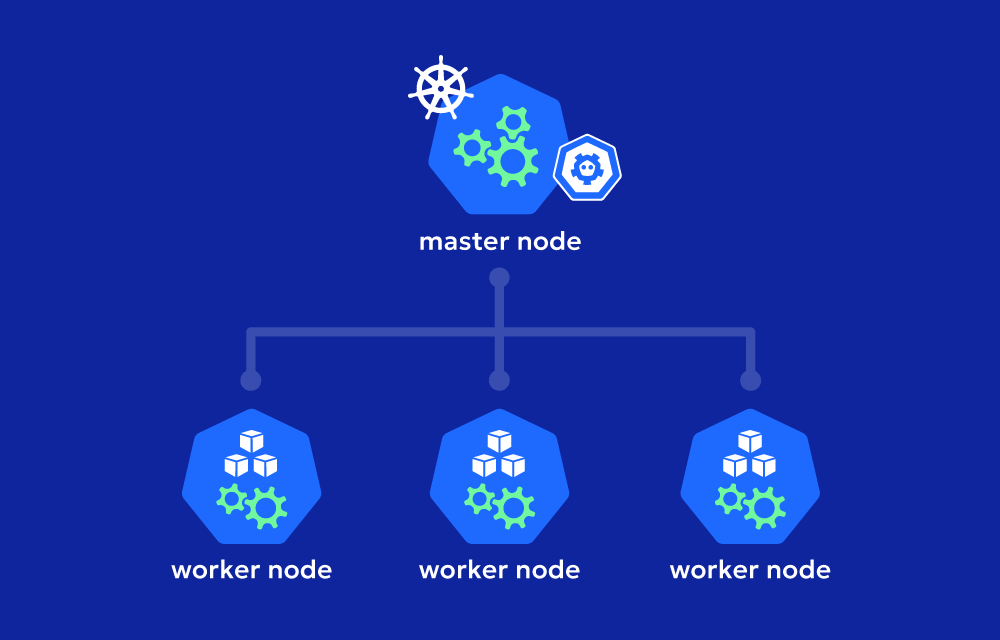
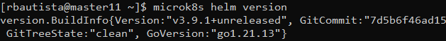
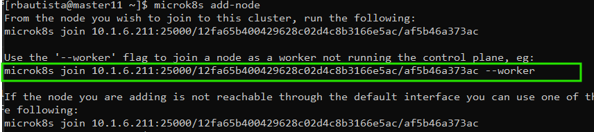
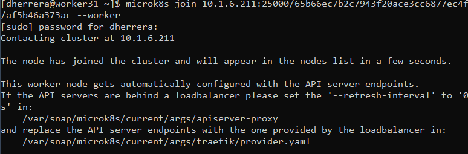
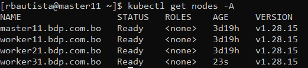
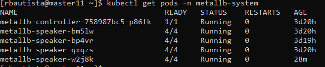
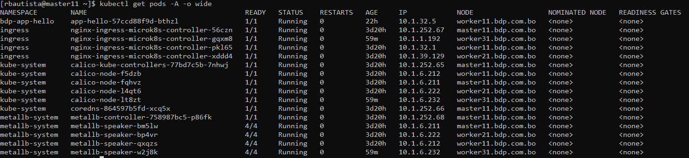
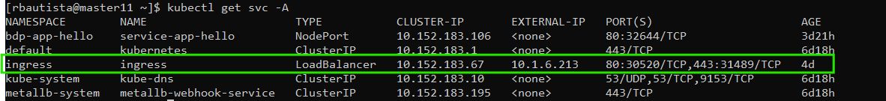

# **Configuración del k8s con nodos worker**




## **Pasos para realizar la configuración**

Primero necesita instalar **microk8s** en su servidor maestro y en los nodos que necesita. Para facilitar su instalación, utilice el script [`01_install_k8s.sh`](./assets/scripts/01_install_k8s.sh) ubicado en la carpeta de `assets/scripts/01_install_k8s.sh` para automatizar su instalación.

> La versión de microk8sse utilizará para esta configuración es: `MicroK8s v1.28.15`

Para configurar el **metallb** se utilizará el gestor de paquetes `helm` que kubernetes nos proporciona.

### **Configuracion de Helm**

La versión utilizada para `helm` en esta configuración es la siguiente: `v3.9.1`



### Añadir Nodos Worker al Nodo Maestro

Dentro del nodo maestro, se debe crear un *token* que permitirá la vinculación entre el nodo maestro y los nodos workers, para ello ejecute el siguiente comando:

```bash
microk8s add-node
```

Una vez ejecutado el comando anterior, se le mostrará la siguiente información:



Utilize el comando proporcionado por `microk8s` como se muestra en la imagen de arriba en su servidor que actuará como nodo worker:

Una vez ejecutado el comando, se espera una salida como la siguiente:



Dentro del nodo master, verfique todos los nodos worker esten en estado de `Ready` si es asi, entonces indica que los nodos han sido vinculados exitosamente al nodo master.



Una vez realizada esta configuración, puedes pasar a configurar el metallb.

## **Configuración del `metallb`**

> La version de metallb para esta configuración es la `v.14.9` 

Para poder instalar `metallb` realizamos la instalación desde el repositorio oficial de `metallb`

Ejecuta este comando en el *nodo master*:

```bash
kubectl apply -f https://raw.githubusercontent.com/metallb/metallb/v0.14.9/config/manifests/metallb-native.yaml
```
Esto descargara y preconfigurará todo lo necesario para poder trabajar con metallb.

El problema que puede sucitarse tras la pre-configuración de metallb, es que necesite validar el webhook del controller de metallb, en ese caso deshabilitaremos la opción `crds.validationsFailurePolicy` con helm

```bash
helm upgrade --install metallb  metallb/metallb --create-namespace --namespace metallb-system --set crds.validationFailurePolicy=Ignore --wait
 ```

Luego, verifique que los speakers de metallb esten en `Running`



Luego aplique loa configuración `IPAddressPool` y `L2Advertisement` que metallb necesita, para ello se proporciona el archivo `metallb-config.yaml`

Archivo: [`metallb-config.yaml`](./assets/configurations/metallb-config.yaml)

```yaml
apiVersion: metallb.io/v1beta1
kind: IPAddressPool
metadata:
  name: default-pool
  namespace: metallb-system
spec:
  addresses:
    - 10.1.6.213-10.1.6.215 # Configure el rango de ips disponibles en su red

---
apiVersion: metallb.io/v1beta1
kind: L2Advertisement
metadata:
  name: l2-adv
  namespace: metallb-system
spec:
  ipAddressPools:
  - default-pool
```

Luego aplique esta configuracion del archivo con: 

```bash
kubectl apply -f metallb-config.yaml
```

Tendría que generar la siguiente salida:

```bash
ipaddresspool.metallb.io/default-pool configurated
l2advertisement.metallb.io/l2-adv configurated
```

Entonces, ya puede utilizar metallb para sus servicios, verificando que este todo bien hasta aqui puede los recursos de: `L2Advertisement` y `IPAddressPool`

### **Configuración del Ingress**

El ingress es el servicio que se conectará al nodo worker automaticamente. Aplique la configuración del archivo [`ingress-route.yaml`](./assets/configurations/ingress-route.yaml)

```bash
kubectl apply -f ingress.route.yaml
```

Aplique la configuración del archivo [`app-hello.yaml`](./assets/configurations/app-hello.yaml)

```bash
kubectl apply -f app-hello.yaml
```

Este archivo contiene la configuracion del `Service` y el `Deployment` necesarios para desplegar el servicio y el pod de ejemplo:



Verfique el servicio del ingress este tomando la ip de uno de los nodos worker configurados en [`metallb-config.yaml`](./assets/configurations/metallb-config.yaml) 



---
> *Version de la documentación:* 1.0